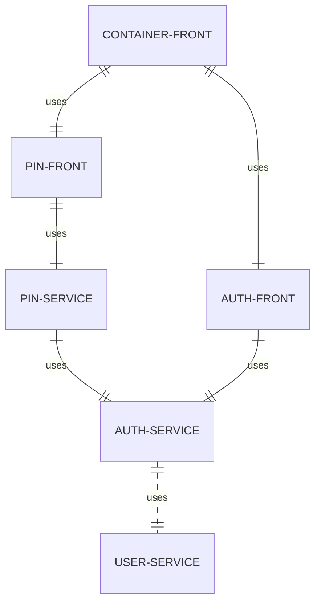
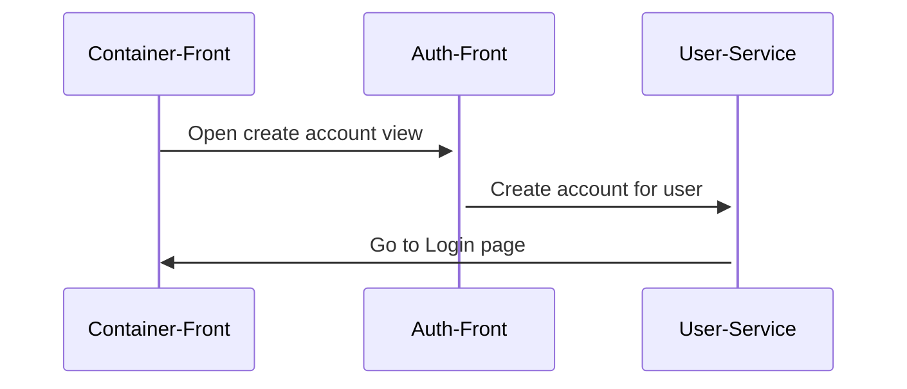
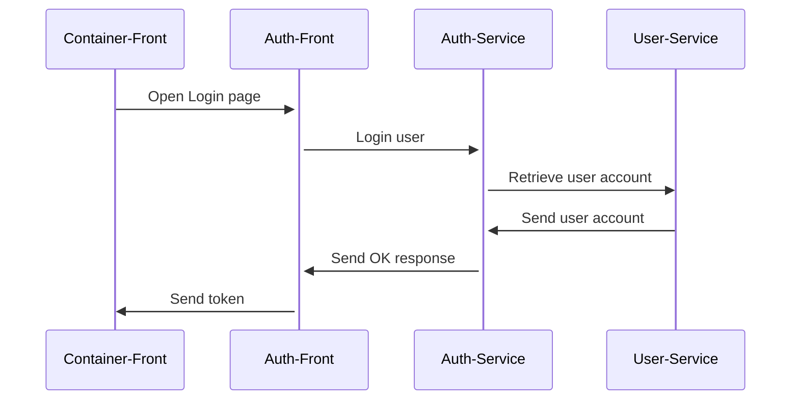
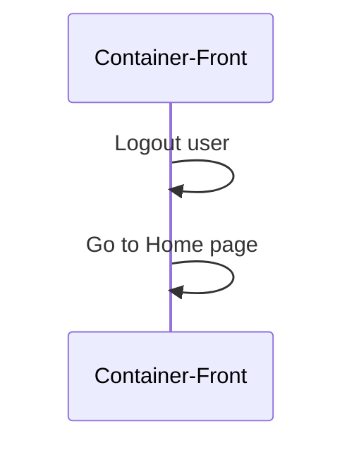
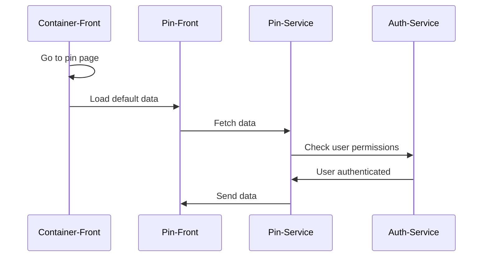
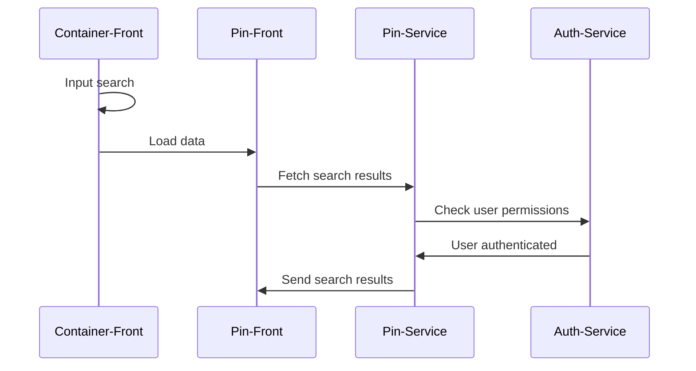

# Pinterest Clone

## Architecture

Application architecture

## Backend

- NestJS based microservices

### Services

- Auth microservice
  - handles the user authorization accross the application
- User microservice
  - handles user account operations (create account, get account details)
- Pin microservice
  - serves the main content of the application
  - makes use of the [Pexels API](https://www.pexels.com/api)
  - uses both in-memory and DB to cache the data retrieved from the API

## Database

- The backend services use a MySQL database for intermediary storage and caching
- The database is shared between the services

## Frontend

- React micro-frontend apps which use [Webpack Module Federation](https://webpack.js.org/concepts/module-federation/) to load the remote applications

### Services

- Auth frontend
  - exposes authentication related components (Login, Signup)
- Pin frontend
  - exposes the main features of the application
- Container frontend
  - wraps the Auth and Pin frontends and serves the application to the user

## Use cases

### Create account for user

### Login user

### Logout user

### See curated pins

### Search for specific pins

### Used patterns

- API gateway
- Messaging
- Access Token
- Decompose by business capability
